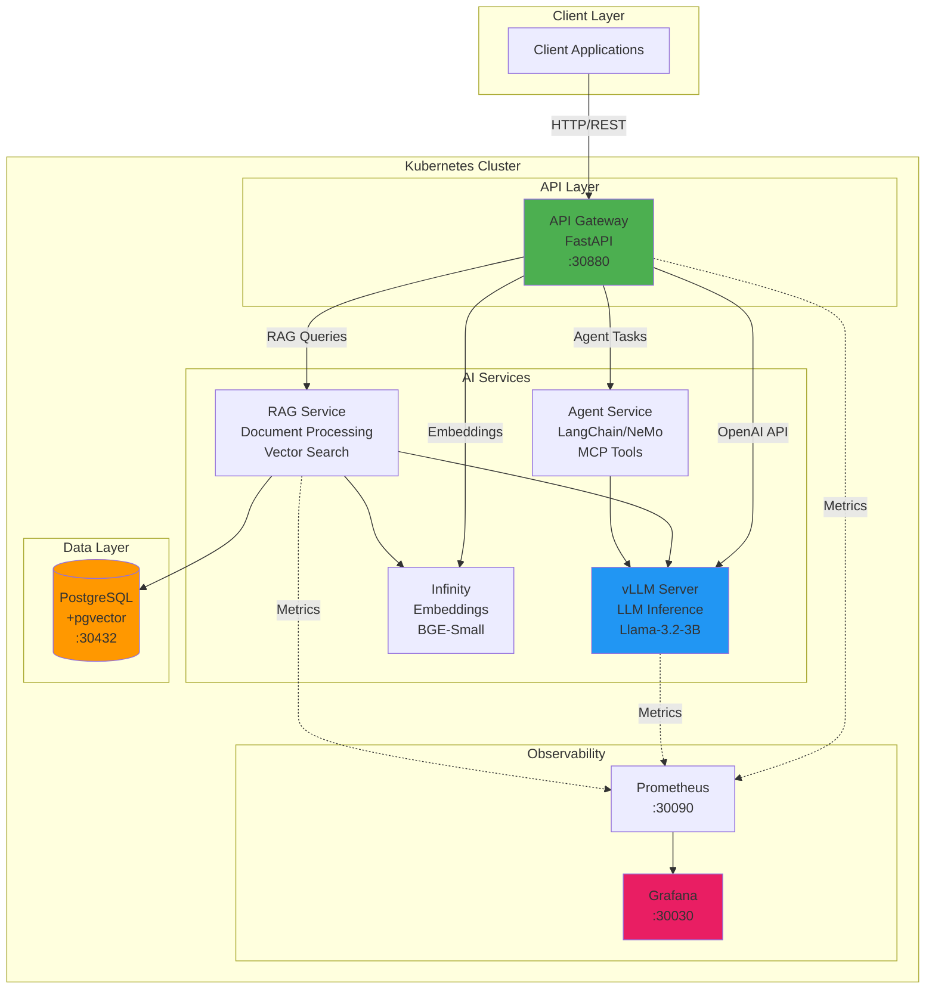

# Private Enterprise AI Platform

Open-source platform for deploying private AI infrastructure with local LLMs, RAG pipelines, and AI agents - no data leaves your environment.

## Features

- **Local LLM Inference**: Run models like Llama, Mistral, or custom models on your hardware
- **RAG Pipelines**: Document ingestion, embedding generation, and semantic search
- **AI Agents**: Multi-step reasoning with tool integration via MCP protocol
- **Multi-tenancy**: Secure tenant isolation with RBAC and authentication
- **GPU Management**: NVIDIA GPU Operator (Linux) or Apple Metal via Ollama (Mac)
- **OpenAI-Compatible API**: Drop-in replacement for OpenAI API
- **Enterprise Observability**: Prometheus, Grafana, Loki, Tempo integration
- **Kubernetes-Native**: Production-ready deployment on any K8s cluster

## Quick Start

### Prerequisites

- Docker Desktop (Mac) or Docker Engine (Linux)
- `kubectl`, `helm`, `kind` CLIs

```bash
# Mac — install all prerequisites
brew install kind kubectl helm
# Docker Desktop: https://www.docker.com/products/docker-desktop/
```

> **RAM / Disk**: 16 GB+ RAM and 50 GB+ free disk recommended.

---

## 🍎 Mac / Apple Silicon (M-series) — Default Path

Mac M-series chips use **Apple Metal** for GPU acceleration (no NVIDIA/CUDA required).  
The model server runs **outside** the kind cluster via [Ollama](https://ollama.com/).  
All other services (PostgreSQL, Prometheus, Grafana, API Gateway) deploy inside kind normally.

### Stage 0 — Create kind cluster (Mac)

```bash
cd infra/kind && bash setup-kind.sh
# or: make kind-up
```

### Stage 1 — Core Infrastructure

```bash
bash scripts/install-stage1.sh
# or: make deploy-stage1
```

### Stage 2 — Model Server (Ollama, Metal-accelerated)

Run **in a separate terminal** — Ollama stays running in the background.

```bash
bash scripts/run-ollama-local.sh
# or: make model-server
```

This installs Ollama (if needed), starts the service, and pulls `llama3.2:3b`.  
The API is OpenAI-compatible at `http://localhost:11434`.

### Stage 3 — API Gateway

```bash
bash scripts/install-stage3.sh
# or: make deploy-stage3
```

### Stage 4 — Embedding Service (Infinity)

```bash
bash scripts/install-stage4.sh
# or: make deploy-stage4
```

Deploys [Infinity](https://github.com/michaelfeil/infinity) with `BAAI/bge-small-en-v1.5` (384-dim) into the cluster.  
No platform differences — runs CPU-only on both Mac and NVIDIA nodes.  
First run downloads ~200 MB model; subsequent starts use the cached PVC.

### Deploy All Stages at Once (Mac)

```bash
make deploy-all
# or: bash scripts/install-all.sh all
```

### Verify (Mac)

```bash
curl http://localhost:30880/health          # API Gateway
curl http://localhost:11434/v1/models       # Ollama model list
bash scripts/verify-gpu.sh                 # Apple Silicon + Ollama status
```

---

## 🟢 NVIDIA GPU (Linux / WSL2) — GPU Path

Use this path on **Linux** with a CUDA-capable NVIDIA GPU (tested: RTX 4060, A100/H100).  
vLLM runs **inside** the kind cluster with full GPU access via the NVIDIA GPU Operator.

> **WSL2 note**: GPU passthrough into kind is not supported in WSL2.  
> On WSL2, run `GPU_MODE=nvidia bash scripts/install-stage2.sh` which deploys vLLM as an external process instead of in-cluster.

### Stage 0 — Create kind cluster (NVIDIA)

```bash
cd infra/kind && bash setup-kind-gpu.sh
# then:
cd infra/k8s && bash install-gpu-operator.sh
# or: make kind-up-nvidia
```

### Stage 1 — Core Infrastructure

```bash
bash scripts/install-stage1.sh
# or: make deploy-stage1
```

### Stage 2 — Model Server (vLLM, NVIDIA in-cluster)

```bash
GPU_MODE=nvidia bash scripts/install-stage2.sh
# or: make deploy-stage2-nvidia
```

### Stage 3 — API Gateway

```bash
bash scripts/install-stage3.sh
# or: make deploy-stage3
```

### Stage 4 — Embedding Service (Infinity)

```bash
bash scripts/install-stage4.sh
# or: make deploy-stage4
```

### Deploy All Stages at Once (NVIDIA)

```bash
make deploy-all-nvidia
# or: GPU_MODE=nvidia bash scripts/install-all.sh all
```

### Verify (NVIDIA)

```bash
curl http://localhost:30880/health          # API Gateway
curl http://localhost:30800/v1/models       # vLLM model list
bash scripts/verify-gpu.sh                 # NVIDIA K8s GPU check (Linux auto-detected)
```

---

## Access Points

| Service | URL | Credentials |
|---------|-----|-------------|
| API Gateway | http://localhost:30880 | — |
| Grafana | http://localhost:30030 | admin / admin |
| Prometheus | http://localhost:30090 | — |
| PostgreSQL | localhost:30432 | postgres / changeme-postgres-admin |
| Ollama API (Mac) | http://localhost:11434 | — |
| vLLM API (NVIDIA) | http://localhost:30800 | — |
| Infinity Embeddings | cluster-internal only | — |

```bash
# Full status check
kubectl get pods --all-namespaces
kubectl get svc --all-namespaces
```

---

## Script Reference

| Script | Platform | Purpose |
|--------|----------|---------|
| `infra/kind/setup-kind.sh` | Mac | Create kind cluster (no GPU mounts) |
| `infra/kind/setup-kind-gpu.sh` | Linux/NVIDIA | Create kind cluster with NVIDIA device mounts |
| `scripts/install-stage1.sh` | Both | Deploy PostgreSQL + Prometheus + Grafana |
| `scripts/install-stage2.sh` | Both | Model server: Ollama (mac) or vLLM (GPU_MODE=nvidia) |
| `scripts/install-stage3.sh` | Both | Deploy API Gateway |
| `scripts/install-stage4.sh` | Both | Deploy Infinity Embeddings Service |
| `scripts/install-stage5-hybrid.sh` | Both | Deploy Hybrid RAG service (Elasticsearch + reranker) |
| `scripts/install-stage5-agentic.sh` | Both | Deploy Agentic RAG service (LangGraph) |
| `scripts/install-stage5-graph.sh` | Both | Deploy Graph RAG service (Neo4j) |
| `scripts/run-ollama-local.sh` | Mac | Start Ollama service + pull model |
| `scripts/run-vllm-local.sh` | Linux/NVIDIA | Start vLLM server (CUDA required) |
| `scripts/verify-gpu.sh` | Both | Platform-aware compute check |
| `scripts/install-all.sh` | Both | Orchestrate all stages (respects GPU_MODE) |

---

## Project Status

**Current Stage**: Stage 5 — RAG Services (Hybrid, Agentic, Graph)  
**Status**: Complete  
**Last Updated**: 2026-07-22

**Completed Stages:**
- ✅ Stage 0: Foundation Setup (kind cluster)
- ✅ Stage 1: Core Infrastructure (PostgreSQL + Prometheus + Grafana)
- ✅ Stage 2: Model Inference Runtime (Ollama on Mac / vLLM on NVIDIA)
- ✅ Stage 3: API Gateway (FastAPI with OpenAI-compatible endpoints)
- ✅ Stage 4: Embedding Service (Infinity + BAAI/bge-small-en-v1.5, 384-dim)
- ✅ Stage 5: RAG Services (Hybrid Search + Agentic LangGraph + Graph Neo4j)

**Next:** Stage 6 — RAG Evaluation & Observability (RAGAS metrics, Langfuse dashboards)

See [IMPLEMENTATION_PLAN.md](IMPLEMENTATION_PLAN.md) for detailed stage-by-stage roadmap.

## Architecture

### High-Level System Architecture



### Current Implementation Status

**Completed (Stages 0-5)**:
- ✅ Kubernetes cluster (kind)
- ✅ PostgreSQL + pgvector
- ✅ Prometheus & Grafana
- ✅ API Gateway (router-split, per-domain clients)
- ✅ Infinity Embeddings (BAAI/bge-small-en-v1.5, 384-dim)
- ✅ Infinity Reranker (BAAI/bge-reranker-v2-m3, separate pod)
- ✅ Hybrid RAG (pgvector + Elasticsearch BM25 + RRF + cross-encoder)
- ✅ Agentic RAG (LangGraph self-correcting, Langfuse tracing)
- ✅ Graph RAG (Neo4j knowledge graph + entity extraction + hybrid traversal)

**Pending (Stages 6+)**:
- ⏳ Auth & Multi-tenancy (Stage 7 — Keycloak, JWT)
- ⏳ Model Registry (Stage 8 — Harbor)
- ⏳ Agent Platform (Stages 10-11 — MCP, LangChain agents)

Full architecture details in `docs/architecture/`.

## Documentation

- **[Implementation Plan](IMPLEMENTATION_PLAN.md)**: Stage-by-stage development guide
- **[Technology Stack](docs/tech/)**: Reference docs for all technologies used
- **[Architecture](docs/architecture/)**: System design and decisions (coming in Stage 1+)
- **[API Documentation](docs/api/)**: API specs and examples (coming in Stage 3+)
- **[Deployment Guide](docs/deployment/)**: Production deployment instructions (coming in Stage 12)

## Technology Stack

**Infrastructure**: Kubernetes, Helm, kind, NVIDIA GPU Operator  
**AI Runtime**: vLLM, llama.cpp, Infinity Embeddings, NVIDIA NeMo  
**Backend**: Python, FastAPI, LangChain, LlamaIndex  
**Storage**: PostgreSQL + pgvector, Harbor Registry  
**Observability**: Prometheus, Grafana, Loki, Tempo, OpenTelemetry  
**Security**: Keycloak, HashiCorp Vault, RBAC

See `docs/tech/` for detailed technology descriptions.

## Development Workflow

This project follows a **stage-gate approach**:

1. Review stage objectives in IMPLEMENTATION_PLAN.md
2. Implement stage deliverables
3. Test against exit criteria
4. User review and approval
5. Proceed to next stage

See [IMPLEMENTATION_PLAN.md](IMPLEMENTATION_PLAN.md) for full workflow details.

## Project Structure

```
vmware_private_ai/
├── apps/              # Application services (api-gateway, rag-service, etc.)
├── infra/             # Infrastructure as code (Helm charts, K8s manifests)
├── packages/          # Shared libraries (auth, observability, common)
├── docs/              # Documentation
├── scripts/           # Utility scripts
├── models/            # Model storage (gitignored)
└── tests/             # Integration and E2E tests
```

## Contributing

This project is in active development. Contributions welcome after Stage 6 (core RAG functionality complete).

## License

[To be determined - suggest Apache 2.0 or MIT]

## Support

For questions or issues during development, contact the project maintainer.

---

**Note**: This platform is designed for private enterprise use. All processing happens locally - no data is sent to external AI providers.
