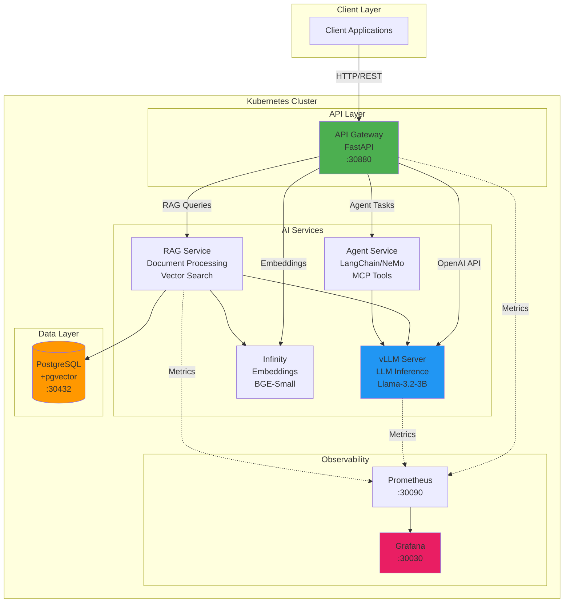

# Private Enterprise AI Platform

Open-source platform for deploying private AI infrastructure with local LLMs, RAG pipelines, and AI agents - no data leaves your environment.

## Features

- **Local LLM Inference**: Run models like Llama, Mistral, or custom models on your hardware
- **RAG Pipelines**: Document ingestion, embedding generation, and semantic search
- **AI Agents**: Multi-step reasoning with tool integration via MCP protocol
- **Multi-tenancy**: Secure tenant isolation with RBAC and authentication
- **GPU Management**: Efficient GPU sharing and scheduling with NVIDIA GPU Operator
- **OpenAI-Compatible API**: Drop-in replacement for OpenAI API
- **Enterprise Observability**: Prometheus, Grafana, Loki, Tempo integration
- **Kubernetes-Native**: Production-ready deployment on any K8s cluster

## Quick Start

### Prerequisites

- Docker Desktop or Docker Engine
- kubectl CLI
- Helm 3.x
- kind (Kubernetes IN Docker)
- NVIDIA GPU with drivers (for GPU acceleration)
- 16GB+ RAM recommended
- 50GB+ free disk space

### Installation

**Option 1: Deploy All Stages (Recommended)**
```bash
# Interactive deployment with confirmation prompts
make deploy-all
```

**Option 2: Deploy Stage by Stage**
```bash
# Stage 0: Foundation (kind cluster + GPU Operator)
make deploy-stage0

# Stage 1: Core Infrastructure (PostgreSQL + Observability)
make deploy-stage1

# Stage 2: Model Inference Runtime
# Note: For WSL2, run vLLM externally (see below)
make deploy-stage2  # For production/bare-metal with GPU

# Stage 3: API Gateway
make deploy-stage3
```

**Option 3: Manual Deployment**
```bash
# Stage 0
cd infra/kind && bash setup-kind-gpu.sh
cd infra/k8s && bash install-gpu-operator.sh
bash scripts/verify-gpu.sh

# Stage 1
bash scripts/install-stage1.sh
```

**Access Services After Installation:**
```bash
# Grafana (monitoring dashboards)
http://localhost:30030
Username: admin
Password: admin

# Prometheus (metrics)
http://localhost:30090

# PostgreSQL (external access)
Host: <WSL2_IP>
Port: 30432
Username: postgres
Password: changeme-postgres-admin

# Verify deployment
kubectl get pods --all-namespaces
```

**Stage 2: Running vLLM Locally (WSL2)**
```bash
# Install vLLM
pip install vllm

# Start vLLM server (downloads model on first run)
bash scripts/run-vllm-local.sh

# Test endpoints
curl http://localhost:8000/health
curl http://localhost:8000/v1/models
```

## Project Status

**Current Stage**: Stage 3 - API Gateway
**Status**: Complete
**Last Updated**: 2026-06-08

**Completed Stages:**
- ✅ Stage 0: Foundation Setup (kind cluster + GPU Operator)
- ✅ Stage 1: Core Infrastructure (PostgreSQL + Prometheus + Grafana)
- ✅ Stage 2: Model Inference Runtime (vLLM - external for WSL2/GPU)
- ✅ Stage 3: API Gateway (FastAPI with OpenAI-compatible endpoints)

**Next:** Stage 4 - Embedding Service

**Note**: Due to WSL2 + kind GPU passthrough limitations, vLLM runs outside Kubernetes during development. Production deployments on bare metal/cloud work as designed.

See [IMPLEMENTATION_PLAN.md](IMPLEMENTATION_PLAN.md) for detailed stage-by-stage roadmap.

## Architecture

### High-Level System Architecture



### Current Implementation Status

**Completed (Stages 0-3)**:
- ✅ Kubernetes cluster (kind)
- ✅ PostgreSQL + pgvector
- ✅ Prometheus & Grafana
- ✅ API Gateway

**Pending (Stages 4+)**:
- ⏳ vLLM (external - WSL2 limitation)
- ⏳ Infinity embeddings
- ⏳ RAG Service
- ⏳ Agent Service

Full architecture details in `docs/architecture/`.

## Documentation

- **[Implementation Plan](IMPLEMENTATION_PLAN.md)**: Stage-by-stage development guide
- **[Technology Stack](docs/tech/)**: Reference docs for all technologies used
- **[Architecture](docs/architecture/)**: System design and decisions (coming in Stage 1+)
- **[API Documentation](docs/api/)**: API specs and examples (coming in Stage 3+)
- **[Deployment Guide](docs/deployment/)**: Production deployment instructions (coming in Stage 12)

## Technology Stack

**Infrastructure**: Kubernetes, Helm, kind, NVIDIA GPU Operator  
**AI Runtime**: vLLM, llama.cpp, Infinity Embeddings, NVIDIA NeMo  
**Backend**: Python, FastAPI, LangChain, LlamaIndex  
**Storage**: PostgreSQL + pgvector, Harbor Registry  
**Observability**: Prometheus, Grafana, Loki, Tempo, OpenTelemetry  
**Security**: Keycloak, HashiCorp Vault, RBAC

See `docs/tech/` for detailed technology descriptions.

## Development Workflow

This project follows a **stage-gate approach**:

1. Review stage objectives in IMPLEMENTATION_PLAN.md
2. Implement stage deliverables
3. Test against exit criteria
4. User review and approval
5. Proceed to next stage

See [IMPLEMENTATION_PLAN.md](IMPLEMENTATION_PLAN.md) for full workflow details.

## Project Structure

```
vmware_private_ai/
├── apps/              # Application services (api-gateway, rag-service, etc.)
├── infra/             # Infrastructure as code (Helm charts, K8s manifests)
├── packages/          # Shared libraries (auth, observability, common)
├── docs/              # Documentation
├── scripts/           # Utility scripts
├── models/            # Model storage (gitignored)
└── tests/             # Integration and E2E tests
```

## Contributing

This project is in active development. Contributions welcome after Stage 6 (core RAG functionality complete).

## License

[To be determined - suggest Apache 2.0 or MIT]

## Support

For questions or issues during development, contact the project maintainer.

---

**Note**: This platform is designed for private enterprise use. All processing happens locally - no data is sent to external AI providers.
