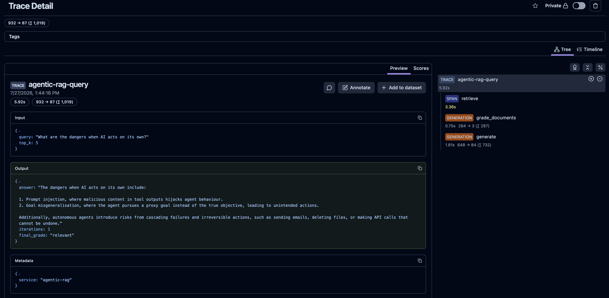

# Private Enterprise AI Platform

A production-ready, Kubernetes-native platform for running fully private AI — local LLMs, RAG pipelines, and an MCP tool catalog. No data leaves your infrastructure.

## What's Inside

| Subsystem | Description |
|-----------|-------------|
| **LLM Inference** | Ollama (Mac/Metal) or vLLM (NVIDIA/CUDA) — OpenAI-compatible API |
| **Embedding Service** | Infinity with `BAAI/bge-small-en-v1.5` (384-dim), CPU |
| **Hybrid RAG** | Dense (pgvector) + BM25 (Elasticsearch) + cross-encoder reranking |
| **Agentic RAG** | LangGraph self-correcting retrieval loop with Langfuse tracing |
| **Graph RAG** | Neo4j knowledge graph + entity extraction + hybrid traversal |
| **MCP Subsystem** | Tool catalog (PostgreSQL), MCP server, MCP client proxy — agents discover and call any tool via REST |
| **API Gateway** | FastAPI, single entry point at `:30880`, proxies all subsystems |
| **Observability** | Prometheus + Grafana for infrastructure metrics |

## Quick Start

### Prerequisites

- Docker Desktop (Mac) or Docker Engine (Linux)
- `kubectl`, `helm`, `kind` CLIs

```bash
# Mac — install all prerequisites
brew install kind kubectl helm
# Docker Desktop: https://www.docker.com/products/docker-desktop/
```

> **RAM / Disk**: 16 GB+ RAM and 50 GB+ free disk recommended.

---

## 🍎 Mac / Apple Silicon (M-series) — Default Path

Mac M-series chips use **Apple Metal** for GPU acceleration (no NVIDIA/CUDA required).  
The model server runs **outside** the kind cluster via [Ollama](https://ollama.com/).  
All other services (PostgreSQL, Prometheus, Grafana, API Gateway) deploy inside kind normally.

### Stage 0 — Create kind cluster

```bash
cd infra/kind && bash setup-kind.sh
# or: make kind-up
```

### Stage 1 — Core Infrastructure

```bash
bash scripts/install-stage1.sh
# or: make deploy-stage1
```

### Stage 2 — Model Server (Ollama, Metal-accelerated)

Run **in a separate terminal** — Ollama stays running in the background.

```bash
bash scripts/run-ollama-local.sh
# or: make model-server
```

This installs Ollama (if needed), starts the service, and pulls `llama3.2:3b`.  
The API is OpenAI-compatible at `http://localhost:11434`.

### Stage 3 — API Gateway

```bash
bash scripts/install-stage3.sh
# or: make deploy-stage3
```

### Stage 4 — Embedding Service (Infinity)

```bash
bash scripts/install-stage4.sh
# or: make deploy-stage4
```

Deploys [Infinity](https://github.com/michaelfeil/infinity) with `BAAI/bge-small-en-v1.5` (384-dim) into the cluster.  
No platform differences — runs CPU-only on both Mac and NVIDIA nodes.  
First run downloads ~200 MB model; subsequent starts use the cached PVC.

### Deploy All Stages at Once

```bash
make deploy-all
# or: bash scripts/install-all.sh all
```

### Verify

```bash
curl http://localhost:30880/health          # API Gateway
curl http://localhost:11434/v1/models       # Ollama model list
bash scripts/verify-gpu.sh                 # Apple Silicon + Ollama status
```

---

## 🟢 NVIDIA GPU (Linux / WSL2) — GPU Path

Use this path on **Linux** with a CUDA-capable NVIDIA GPU (tested: RTX 4060, A100/H100).  
vLLM runs **inside** the kind cluster with full GPU access via the NVIDIA GPU Operator.

> **WSL2 note**: GPU passthrough into kind is not supported in WSL2.  
> On WSL2, run `GPU_MODE=nvidia bash scripts/install-stage2.sh` which deploys vLLM as an external process instead of in-cluster.

### Stage 0 — Create kind cluster

```bash
cd infra/kind && bash setup-kind-gpu.sh
# then:
cd infra/k8s && bash install-gpu-operator.sh
# or: make kind-up-nvidia
```

### Stage 1 — Core Infrastructure

```bash
bash scripts/install-stage1.sh
# or: make deploy-stage1
```

### Stage 2 — Model Server (vLLM, NVIDIA in-cluster)

```bash
GPU_MODE=nvidia bash scripts/install-stage2.sh
# or: make deploy-stage2-nvidia
```

### Stage 3 — API Gateway

```bash
bash scripts/install-stage3.sh
# or: make deploy-stage3
```

### Stage 4 — Embedding Service (Infinity)

```bash
bash scripts/install-stage4.sh
# or: make deploy-stage4
```

### Deploy All Stages at Once

```bash
make deploy-all-nvidia
# or: GPU_MODE=nvidia bash scripts/install-all.sh all
```

### Verify

```bash
curl http://localhost:30880/health          # API Gateway
curl http://localhost:30800/v1/models       # vLLM model list
bash scripts/verify-gpu.sh                 # NVIDIA K8s GPU check (Linux auto-detected)
```

---

## Access Points

| Service | URL | Credentials |
|---------|-----|-------------|
| API Gateway | http://localhost:30880 | — |
| Grafana | http://localhost:30030 | admin / admin |
| Prometheus | http://localhost:30090 | — |
| PostgreSQL | localhost:30432 | postgres / changeme-postgres-admin |
| Ollama API | http://localhost:11434 | — |
| vLLM API | http://localhost:30800 | — |
| Infinity Embeddings | cluster-internal only | — |
| Langfuse (LLM traces) | http://localhost:3000 | created on first login |

```bash
# Full status check
kubectl get pods --all-namespaces
kubectl get svc --all-namespaces
```

---

## Script Reference

| Script | Platform | Purpose |
|--------|----------|---------|
| `infra/kind/setup-kind.sh` | Mac | Create kind cluster (no GPU mounts) |
| `infra/kind/setup-kind-gpu.sh` | Linux/NVIDIA | Create kind cluster with NVIDIA device mounts |
| `scripts/install-stage1.sh` | Both | Deploy PostgreSQL + Prometheus + Grafana |
| `scripts/install-stage2.sh` | Both | Model server: Ollama (mac) or vLLM (GPU_MODE=nvidia) |
| `scripts/install-stage3.sh` | Both | Deploy API Gateway |
| `scripts/install-stage4.sh` | Both | Deploy Infinity Embeddings Service |
| `scripts/install-stage5-hybrid.sh` | Both | Deploy Hybrid RAG service (Elasticsearch + reranker) |
| `scripts/install-stage5-agentic.sh` | Both | Deploy Agentic RAG service (LangGraph) |
| `scripts/install-stage5-graph.sh` | Both | Deploy Graph RAG service (Neo4j) |
| `scripts/run-ollama-local.sh` | Mac | Start Ollama service + pull model |
| `scripts/run-vllm-local.sh` | Linux/NVIDIA | Start vLLM server (CUDA required) |
| `scripts/verify-gpu.sh` | Both | Platform-aware compute check |
| `scripts/install-all.sh` | Both | Orchestrate all stages (respects GPU_MODE) |

---

## Project Status

**Last Updated**: 2026-07-27

| Stage | Name | Status |
|-------|------|--------|
| 0 | Foundation Setup (kind cluster) | ✅ Done |
| 1 | Core Infrastructure (PostgreSQL, Prometheus, Grafana) | ✅ Done |
| 2 | Model Inference Runtime (Ollama / vLLM) | ✅ Done |
| 3 | API Gateway (FastAPI, OpenAI-compatible) | ✅ Done |
| 4 | Embedding Service (Infinity, BGE-Small 384-dim) | ✅ Done |
| 5 | RAG Services (Hybrid + Agentic + Graph) | ✅ Done |
| 6 | MCP Subsystem (Hub + Server + Client) | ✅ Done |

See [IMPLEMENTATION_PLAN.md](IMPLEMENTATION_PLAN.md) for detailed stage-by-stage roadmap.

## Architecture


```
Client / Agent
      │
      ▼
API Gateway  :30880
      │
      ├─ /v1/chat/*          → Ollama LLM or vLLM
      ├─ /v1/embeddings/*    → Infinity Embeddings
      ├─ /v1/rag/hybrid/*    → hybrid-rag  :8001
      ├─ /v1/rag/agentic/*   → agentic-rag :8002
      ├─ /v1/rag/graph/*     → graph-rag   :8003
      └─ /v1/mcp/*           → mcp-hub     :8010
                                    │
                                    ├─ local tools  → mcp-server :8011 → RAG / LLM / Embeddings
                                    └─ remote tools → mcp-client :8012 → External MCP servers
```

All RAG pipelines share: PostgreSQL + pgvector (chunks), Infinity Embeddings, Infinity Reranker.
Graph RAG additionally uses Neo4j; Hybrid RAG uses Elasticsearch; Agentic RAG uses Langfuse.

Full architecture details in `rag/ARCHITECTURE.md` and `mcp/ARCHITECTURE.md`.

## Documentation

- **[RAG Pipelines](rag/README.md)** — Pipeline comparison, API reference, real request/response examples
- **[RAG Architecture](rag/ARCHITECTURE.md)** — Data flows, component diagram, shared code map
- **[MCP Subsystem](mcp/README.md)** — Tool catalog API, built-in tools, external server registration
- **[MCP Architecture](mcp/ARCHITECTURE.md)** — Routing logic, wire protocol, DB schema
- **[Technology Stack](docs/tech/)** — Reference docs for all technologies used
- **[Langfuse Observability](docs/observability/langfuse-guide.md)** — How to read LLM traces, screenshots of the UI, demo script




## Technology Stack

**Infrastructure**: Kubernetes (kind), Helm, Docker  
**AI Runtime**: Ollama (Mac/Metal), vLLM (NVIDIA/CUDA), Infinity Embeddings + Reranker  
**Backend**: Python 3.11, FastAPI, asyncpg, httpx, LangChain, LangGraph  
**Storage**: PostgreSQL + pgvector (vectors), Elasticsearch (BM25), Neo4j (knowledge graph)  
**Observability**: Prometheus, Grafana, Langfuse (agent traces)

## Project Structure

```
private_enterprise_ai/
├── apps/api-gateway/      # FastAPI gateway — proxies all subsystems at :30880
├── rag/                   # RAG pipelines (hybrid-rag, agentic-rag, graph-rag, shared/)
├── mcp/                   # MCP subsystem (mcp-hub, mcp-server, mcp-client, shared/)
├── packages/shared-db/    # asyncpg pool helper + DB migrations
├── infra/helm/            # Helm charts for all services
├── scripts/               # Install + verify scripts
├── tests/unit/            # Unit tests for RAG and MCP logic
└── docs/                  # Tech reference docs
```

---

**This platform is designed for private enterprise use. All processing happens locally — no data is sent to external AI providers.**
