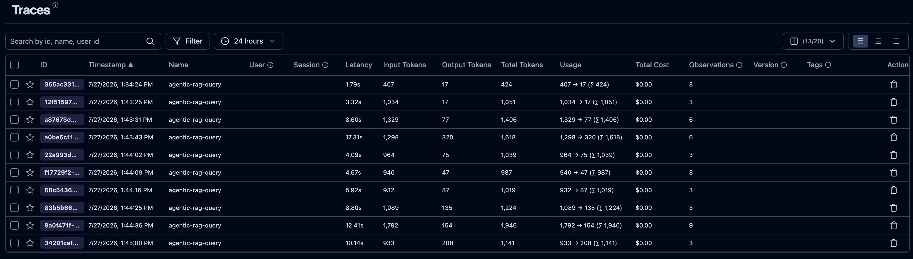
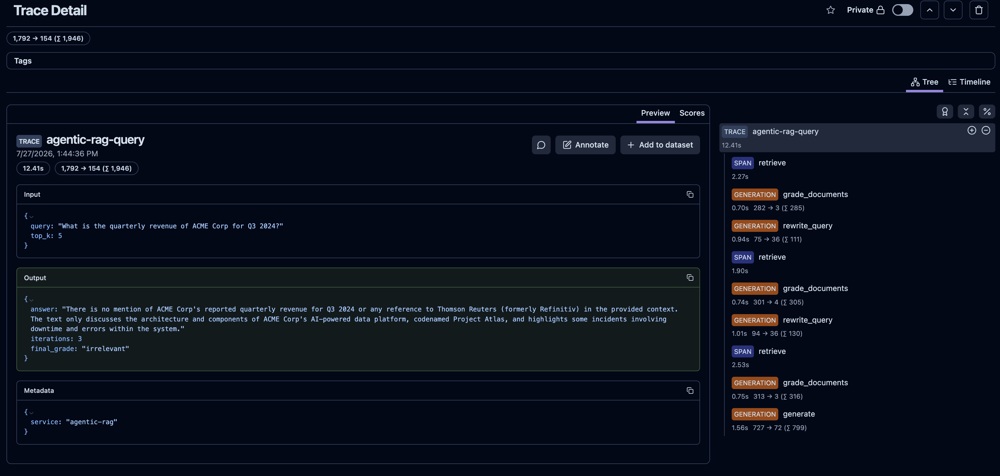

# Langfuse — LLM Observability for Agentic RAG

Langfuse is a self-hosted LLM observability platform that records every request flowing
through the **Agentic RAG** pipeline. It captures prompts, completions, token usage, latency,
and the full LangGraph execution tree — all in one place.

## Access

| | |
|---|---|
| **URL** | http://localhost:3000 |
| **Default credentials** | created on first login (email + password) |

Langfuse starts automatically with the RAG Docker Compose stack:

```bash
docker compose -f rag/docker-compose.yml up -d
```

## What Gets Traced

Every `POST /query` to the Agentic RAG service (port 8002) produces one **Trace** in Langfuse
containing up to four nested observations:

| Observation | Type | What it records |
|---|---|---|
| `retrieve` | Span | Query sent to hybrid-rag, number of documents returned, latency |
| `grade_documents` | Generation | Relevance prompt, model reply (`relevant` / `irrelevant`), token counts |
| `rewrite_query` | Generation | Rewrite prompt, rewritten question, token counts (only when grade = irrelevant) |
| `generate` | Generation | Full answer prompt, final LLM response, token counts |

Queries that need multiple retrieval iterations (because documents are graded `irrelevant`)
produce additional `grade_documents` + `rewrite_query` nodes — you can see the full loop in
the trace timeline.

## Navigating the UI

### Traces list

Open **http://localhost:3000 → Traces** to see all recorded requests. Each row shows the input
query, the final answer, total latency, and token usage.



### Trace detail — relevant result

Click any trace row to open the detail view. The left panel shows the observation tree;
clicking a node fills the right panel with its input, output, and metadata.

The screenshot below shows a trace where documents were graded **relevant** on the first try —
the pipeline ran `retrieve → grade_documents → generate` with no rewrite loop.


### Trace detail — irrelevant / rewrite loop

When retrieved documents are graded **irrelevant** the pipeline automatically rewrites the
query and re-retrieves. The trace tree grows to show one or more `rewrite_query` nodes
alongside repeated `grade_documents` steps.



## Generating Demo Traces

The demo script uploads three sample documents and fires 12 curated questions through all
three RAG pipelines, producing varied Langfuse traces including rewrite-loop examples:

```bash
bash scripts/demo-langfuse-traces.sh
```

After the script completes, open **http://localhost:3000 → Traces** — you will see a batch
of new traces with different iteration counts and grading outcomes.

You can also call the Agentic RAG service directly:

```bash
# Single query — appears in Langfuse within a few seconds
curl -X POST http://localhost:8002/query \
  -H "Content-Type: application/json" \
  -d '{"query": "What is HNSW and how does it differ from IVF-PQ?", "top_k": 5}'
```

## API Keys

The Langfuse API keys are set in `rag/docker-compose.yml`:

```yaml
- LANGFUSE_PUBLIC_KEY=pk-lf-...
- LANGFUSE_SECRET_KEY=sk-lf-...
```

To rotate or create new keys: **Langfuse UI → Settings → API Keys → Create new API key**.
After updating the compose file, restart the agentic-rag container:

```bash
docker compose -f rag/docker-compose.yml up -d agentic-rag
```

## SDK Version Note

The RAG stack uses **Langfuse Python SDK v2** (`langfuse>=2.0.0,<3.0.0`). The self-hosted
server image is `langfuse/langfuse:2`. SDK v3/v4 uses an OpenTelemetry-based export protocol
that is incompatible with the v2 server — keep the version pin in place.
