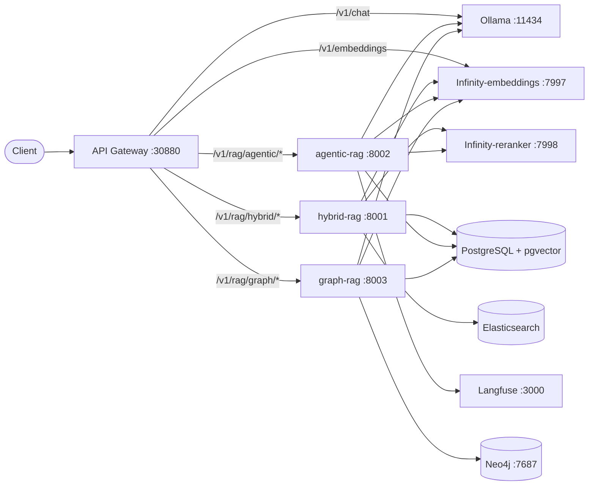
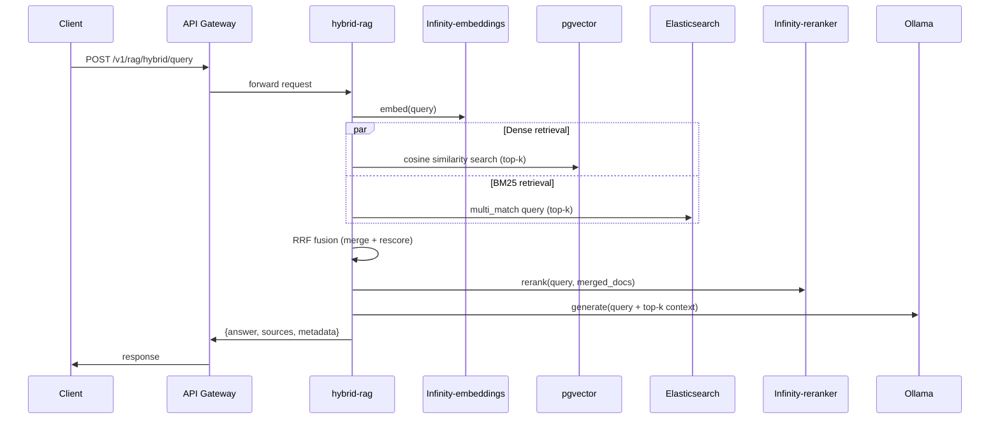
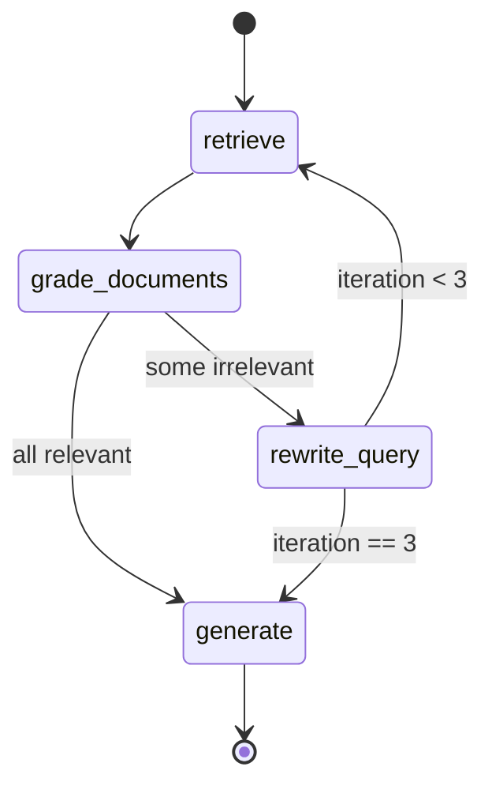
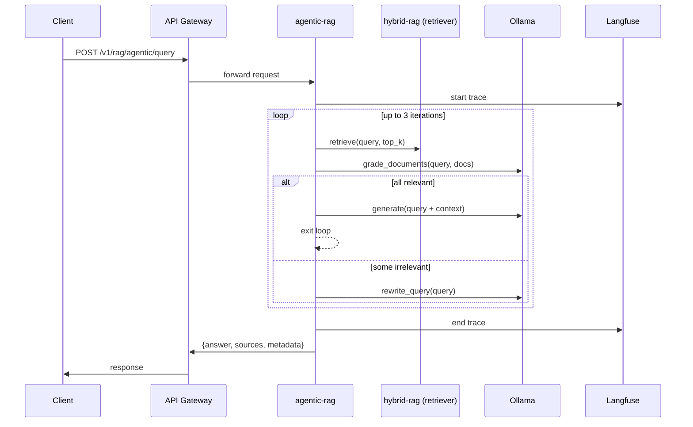
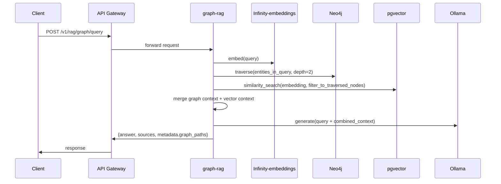

# RAG Architecture

Technical architecture for all three RAG pipelines in this project.
Each pipeline is a separate FastAPI service deployed in Kubernetes, accessible via the API Gateway.

---

## High-Level System Architecture



---

## Shared Infrastructure

| Service | Port | Role |
|---------|------|------|
| `infinity-embeddings` | 7997 (ClusterIP) | Dense vector embeddings (`BAAI/bge-small-en-v1.5`, 384-dim) |
| `infinity-reranker` | 7998 (ClusterIP) | Cross-encoder reranking (`BAAI/bge-reranker-v2-m3`) |
| PostgreSQL + pgvector | 5432 (ClusterIP) | Document/chunk storage + HNSW vector index |
| Elasticsearch | 9200 | BM25 keyword index (Hybrid RAG only) |
| Neo4j | 7687 | Knowledge graph (Graph RAG only) |
| Langfuse | 3000 | Agent trace observability (Agentic RAG) |
| Ollama | 11434 (host) | LLM generation (all pipelines) |

---

## Shared Code (`rag/shared/`)

All three pipelines import from the shared module:

| Module | Purpose |
|--------|---------|
| `ingestion/parsers.py` | PDF, DOCX, TXT, Markdown parsing |
| `ingestion/chunker.py` | Fixed-size chunking with overlap |
| `embeddings/client.py` | Async Infinity-embeddings wrapper (batched, retry-on-503) |
| `reranking/reranker.py` | Async Infinity-reranker wrapper (graceful fallback) |
| `observability/tracing.py` | Langfuse/LangSmith callback setup (config-driven) |
| `evaluation/metrics.py` | Lightweight faithfulness and relevance metrics |

---

## 1. Hybrid Search RAG

### Data Flow



### Ingestion Flow

```
Upload file
  ↓ parse (PDF/DOCX/TXT/MD)
  ↓ chunk_text() → List[Chunk]
  ↓ embed_batch() → List[vector]
  ↓ pgvector INSERT (document + chunks)
  ↓ Elasticsearch INDEX (document text)
  ↓ document.status = "indexed"
```

### Key Components

| File | Responsibility |
|------|---------------|
| `main.py` | FastAPI app: `/upload`, `/query`, `/documents`, `/documents/{id}` |
| `retriever.py` | Parallel dense + BM25 fetch, RRF fusion, calls reranker |
| `pipeline.py` | Orchestrates parse → chunk → embed → store → retrieve → generate |
| `config.py` | Env-based config (DB DSN, ES URL, Infinity URLs, Ollama URL) |

### RRF Fusion Formula

```
score(doc, k=60) = Σ 1 / (k + rank_in_list)
```

Combined over the dense retrieval list and the BM25 list. Higher = better.

---

## 2. Agentic / Self-correcting RAG

### State Machine (LangGraph)



### Data Flow



### GraphState

```python
class GraphState(TypedDict):
    question: str
    documents: list[dict]
    generation: str
    iterations: int
    grade: str  # "relevant" | "irrelevant"
```

### Key Components

| File | Responsibility |
|------|---------------|
| `state.py` | `GraphState` TypedDict definition |
| `nodes.py` | `retrieve`, `grade_documents`, `rewrite_query`, `generate` nodes |
| `workflow.py` | `StateGraph` wiring + conditional edges + max-iteration guard |
| `main.py` | FastAPI: `POST /query` → `graph.invoke()`, Langfuse callback |

---

## 3. Graph RAG

### Data Flow — Ingestion

```
Upload file
  ↓ parse → text
  ↓ chunk_text()
  ↓ embed_batch() → vectors → pgvector
  ↓ LLM extraction prompt → {entities, relationships}
  ↓ Neo4j upsert_entities() + upsert_relationships()
  ↓ document.status = "indexed"
```

### Data Flow — Query



### Knowledge Graph Schema

```
(Document)-[:CONTAINS]->(Entity)
(Entity)-[:RELATED_TO {rel_type}]->(Entity)
```

Example:
```
(api-gateway)-[:CALLS]->(authentication-service)
(authentication-service)-[:STORES_IN]->(postgresql)
```

### Key Components

| File | Responsibility |
|------|---------------|
| `extractor.py` | LLM prompt → JSON `{entities, relationships}`; upserts to Neo4j |
| `graph.py` | Neo4j async client: `upsert_*`, `traverse(entity, depth)` |
| `pipeline.py` | Ingestion + query orchestration |
| `main.py` | FastAPI: `/upload`, `/query`, `/graph/{entity}` |

---

## Dependency Map

```
rag/hybrid-rag/
  → rag/shared/ingestion/     (parse, chunk)
  → rag/shared/embeddings/    (embed)
  → rag/shared/reranking/     (rerank)
  → Infinity-embeddings       (vectors)
  → Infinity-reranker         (cross-encoder scores)
  → pgvector                  (dense store)
  → Elasticsearch             (BM25 index)
  → Ollama                    (LLM generation)

rag/agentic-rag/
  → rag/shared/ingestion/     (parse, chunk)
  → rag/shared/embeddings/    (embed)
  → rag/shared/reranking/     (rerank)
  → rag/shared/observability/ (Langfuse/LangSmith callbacks)
  → hybrid-rag retriever      (via HTTP or shared lib)
  → Ollama                    (grade, rewrite, generate)
  → Langfuse / LangSmith      (trace storage)

rag/graph-rag/
  → rag/shared/ingestion/     (parse, chunk)
  → rag/shared/embeddings/    (embed)
  → Infinity-embeddings       (vectors)
  → pgvector                  (dense store)
  → Neo4j                     (knowledge graph)
  → Ollama                    (extraction + generation)
```

---

## Vector Store Abstraction (Qdrant Migration Path)

The `packages/shared-db/src/shared_db/pgvector.py` layer isolates all vector store calls.
Swapping pgvector for Qdrant requires changing only:

1. `packages/shared-db/src/shared_db/pgvector.py` → implement Qdrant client
2. Helm chart values (add Qdrant chart, remove pgvector vector column)

No RAG pipeline logic files need to change.
